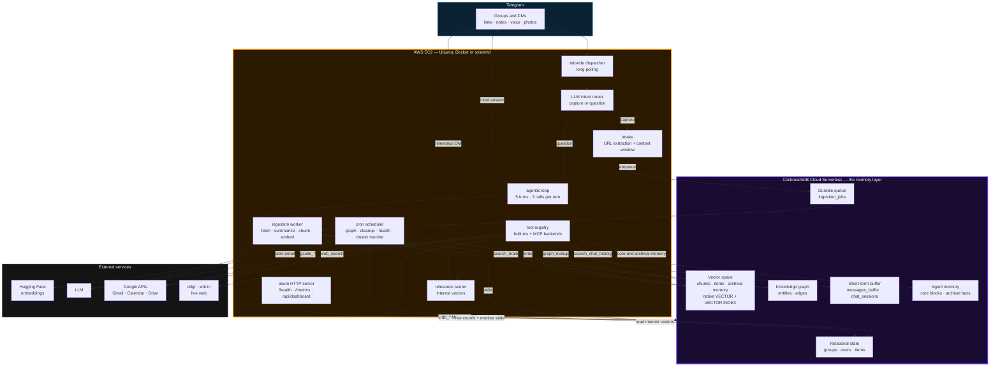
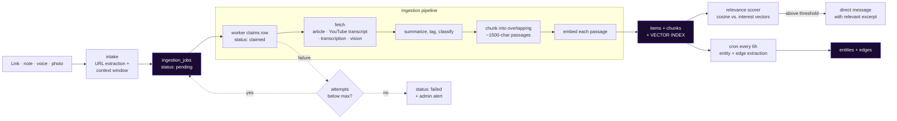
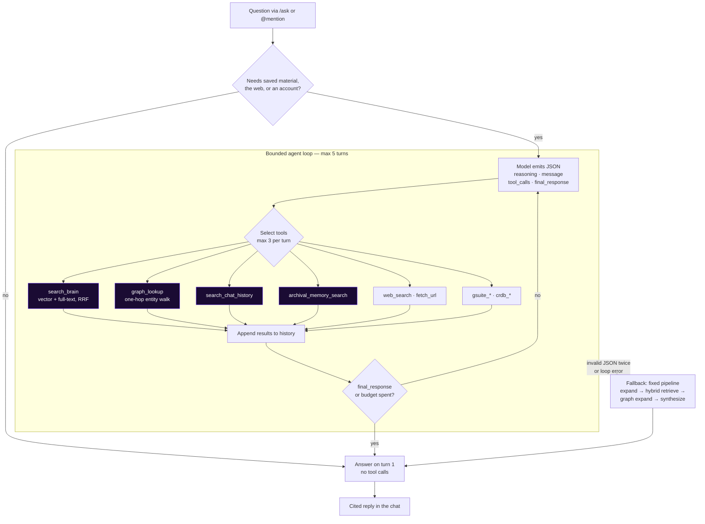

<div align="center">


# ARNHEID

**The Autonomous Memory Engine for Team Communication**

Powered by **CockroachDB Cloud** &nbsp;×&nbsp; **AWS**

[](LICENSE)
[](Cargo.toml)
[](https://cockroachlabs.cloud)
[](#prerequisites--installation)
[](web/)

[Try the bot](https://t.me/arnheidgenbot) &nbsp;·&nbsp; [Demo](#demo) &nbsp;·&nbsp; [Architecture](#architecture)

</div>

---

An intelligent, context-aware AI agent residing directly in your Telegram groups and DMs. Arnheid
silently transcribes voice notes, parses shared links, constructs operational knowledge graphs, and
triggers GSuite integrations — all backed by native database transaction logs and cloud-managed
infrastructure.

**CockroachDB Cloud is the memory layer.** Relational state, semantic vectors, the knowledge graph,
the durable ingestion queue, and the agent's own self-editing memory live in one distributed
database — no separate vector store to keep in sync. The application is a single Rust binary running
on **AWS EC2**.

---

## Table of Contents

- [Key Features](#key-features)
- [Architecture](#architecture)
- [CockroachDB Suites Used](#cockroachdb-suites-used)
- [Prerequisites & Installation](#prerequisites--installation)
- [Environment Guide](#environment-guide)
- [Demo](#demo)
- [Upcoming Features](#upcoming-features)
- [Credits](#credits)
- [License](#license)
- [Contact & Thanks](#contact--thanks)

---

## Key Features

### Capture & Memory

- **Text ingestion & memory** — every message in a chat the bot is in is buffered into a rolling
  48-hour `messages_buffer`, preserving the short-term conversational context around each capture.
  Each stored item also keeps a `context_window` of the messages surrounding it, recording *why*
  something was shared, not only what.
- **Webpage scraping** — any shared URL is fetched and reduced to clean readable text in the
  background (articles, documentation, code repos), with `yt-dlp` pulling transcripts for YouTube
  links. No command or mention required in a group.
- **Voice & photo capture** — Telegram voice notes are transcribed through an OpenAI-compatible
  speech-to-text endpoint; photos are described by LLM vision. Both become first-class searchable
  items alongside links and notes.
- **Durable ingestion queue** — every capture becomes an `ingestion_jobs` row in CockroachDB the
  moment it arrives, so a restart never loses one. A worker claims due rows, retries failures with
  exponential backoff on `run_after`, marks a job permanently failed once it passes
  `INGESTION_MAX_ATTEMPTS`, and reclaims jobs abandoned by a crashed worker.
- **Knowledge graph construction** — a batch extractor pulls entities (people, companies, topics,
  technologies, projects, funds) and typed relationships (`mentions`, `related_to`, `same_topic`,
  `follow_up`, `contradicts`) out of captured content into the `entities` and `edges` tables.

### Reasoning & Action

- **Intent routing** — a lightweight model classifies every inbound message as either a capture or a
  request for the agent, catching imperatives with no question mark and leading mentions that a
  keyword heuristic misses. If the call fails it degrades to that heuristic rather than blocking
  capture.
- **Smart agentic loop** — an iterative reasoning loop, bounded at 5 turns and 3 tool calls per turn,
  where the model decides each turn whether it can answer outright or needs to call a tool. Each turn
  is a JSON object (`reasoning`, `message`, `tool_calls`, `final_response`) parsed from the model's
  text; reasoning and tool calls are logged and never shown to the user.
- **Hybrid semantic retrieval** — content is split into overlapping ~1500-character passages and
  embedded individually. `search_brain` runs a CockroachDB native vector search fused with a
  full-text keyword search via Reciprocal Rank Fusion, so exact terms and acronyms that embeddings
  blur are still found.
- **Graph-aware lookup** — `graph_lookup` walks entity connections one hop, surfacing captures
  related to a named person, company, or topic that plain similarity search would miss.
- **Web search interceptors** — a configurable shell search command (`ddgr`) provides live results
  for questions the saved corpus cannot answer, with a dedicated `wttr.in` lookup intercepting
  weather queries for real-time conditions.
- **GSuite integrations** — autonomous actions over a connected Google account: `gmail_search`,
  `gmail_read`, `gmail_send`, `calendar_events`, `calendar_create_event`, and `drive_search`,
  implemented in-process against Google's REST APIs so no sidecar is deployed and the refresh token
  never leaves the bot.
- **Self-editing agent memory** — labelled core memory blocks always present in the system prompt,
  plus unbounded vector-searched archival memory. The model edits both through its own tools, so what
  it knows about a user persists across sessions because it is a database row, not process state.
- **Relevance interrupt** — per-user interest vectors, updated as a weighted centroid with time
  decay, score each new capture. Crossing a user's threshold sends them a direct message containing
  the relevant excerpt.

### Operations

- **Single Rust binary** — Telegram dispatcher, HTTP server, ingestion worker, relevance scorer,
  agent loop, and cron scheduler all run in-process on one Tokio runtime.
- **Live health dashboard** — a React dashboard polls `/api/dashboard` for cluster status, backup
  freshness, and live memory counts (items, entities, edges, vector chunks).
- **Prometheus metrics** — `/metrics` exposes ask outcomes and latency, ingestion throughput and
  queue depth, send failures, relevance notifications, and agentic-fallback rate.
- **Admin alerting** — a failure in a command, a query, or a message delivery sends a direct message
  to `ADMIN_CHAT_ID`, rate-limited by a per-key cooldown so one broken dependency cannot flood the
  chat.
- **Hardened tool boundary** — third-party MCP tool descriptions and results are stripped of control
  characters, truncated, and namespaced at the boundary, and no server can register a name that
  shadows a built-in tool.

---

## Architecture

### System topology

Where CockroachDB Cloud and AWS sit: EC2 runs stateless compute, CockroachDB Cloud holds every byte
the agent knows.



Restart the EC2 instance and nothing is lost: the queue resumes from `ingestion_jobs`, the corpus and
graph are intact, and the agent still knows the user because its memory is a row in CockroachDB.

### Write path — capture to memory



### Read path — the agentic loop



<details>
<summary><b>Schema — what CockroachDB holds</b></summary>

| Table | Purpose |
| --- | --- |
| `groups`, `users` | Chats and people; `(channel, external_id)` maps native ids onto internal BIGINTs |
| `items` | One row per capture: url, title, `raw_content`, summary, tags, `content_type`, `context_window` (JSONB), item `embedding` |
| `chunks` | Passage text + `embedding`, the retrieval unit, plus a GIN full-text index |
| `entities`, `edges` | The knowledge graph, with typed relationships and strengths |
| `messages_buffer` | Rolling 48-hour buffer used to reconstruct context windows |
| `chat_sessions`, `session_turns` | Per-chat conversational state for multi-turn questions |
| `user_taste_profiles`, `user_profiles` | Interest vector, notify threshold, liked/disliked tags, mute state |
| `user_events` | Behavioural event stream feeding the taste profile |
| `ingestion_jobs` | The durable queue: kind, payload, status, attempts, `run_after` |
| `notifications_log` | One-per-(user,item) dedup plus score log for threshold calibration |
| `agent_memory_blocks`, `agent_archival_memory` | Self-editing core memory and vector-searched long-term facts |
| `channel_events` | Webhook idempotency — replays dropped on conflict |

Migrations `001`–`016` are embedded in the binary and applied at boot. The dimensioned vector columns
and their vector indexes are created at startup from `EMBEDDING_DIM` by `db::ensure_vector_schema`,
because the dimension depends on the configured embedding model.

</details>

---

## CockroachDB Suites Used

Three CockroachDB surfaces, each doing work nothing else in the stack does.

| Suite | How we integrated it | Implementation |
| --- | --- | --- |
| **Vector Similarity Search** | Text embeddings are stored in native `VECTOR` columns beside the relational rows they describe, with `CREATE VECTOR INDEX` backing approximate nearest-neighbour lookup. The retrieval pipeline runs cosine-distance (`<=>`) queries to fetch relevant memory segments whenever a user asks the bot a question, fusing them with GIN full-text results through Reciprocal Rank Fusion. Vectors cross the wire as bracketed text literals, since CockroachDB's `VECTOR` has no client-side binary codec in sqlx. | `src/db/vector.rs`, `src/db/mod.rs` (`ensure_vector_schema`), `src/db/chunks.rs`, `src/db/agent_memory.rs`, `migrations/007`, `008`, `016` |
| **Cloud Managed MCP Server** | A Streamable-HTTP MCP client connects to `cockroachlabs.cloud/mcp`, passing the API key as bearer authorization and the cluster id in an `mcp-cluster-id` header. Its tools are namespaced (`crdb_*`) and merged into the same registry as the built-ins, letting the agent list, inspect, and query database tables dynamically from inside a conversation. | `src/mcp/mod.rs` (`connect_cockroach_cloud`), `src/mcp/client.rs`, `src/config.rs` (`CockroachCloudConfig`) |
| **ccloud CLI** | An automated hourly health check shells out to the CockroachDB Cloud CLI to verify the cluster reports `RUNNING` and that the newest daily backup is under 24 hours old. Results feed the live dashboard; any anomaly sends a Gmail alert through the GSuite tool. It also runs once immediately at startup. | `src/cron/jobs.rs` (`cockroach_cloud_monitor`, `run_ccloud`), `src/cron/mod.rs`, `Dockerfile`, `scripts/provision_cockroachdb.sh` |

**Why CockroachDB Cloud**

- **Unified multi-model memory** — the relational knowledge graph and the high-dimensional semantic
  vectors live in a single database, avoiding the overhead and consistency gaps of syncing separate
  relational and vector stores.
- **Transactional consistency** — serializable ACID transactions across chat history buffers, graph
  edges, and the job queue mean the agent never retrieves a corrupted or duplicated memory.
- **Elastic serverless scaling** — Serverless absorbs real-time Telegram ingestion without a capacity
  decision, keeping the long-term memory layer available under load.

---

## Prerequisites & Installation

### Prerequisites

| Requirement | Why | Where |
| --- | --- | --- |
| Rust 1.82+ | Builds the binary | [rustup.rs](https://rustup.rs) |
| CockroachDB | The memory layer | Docker for local dev, or CockroachDB Cloud Serverless |
| Telegram bot token | The channel | [@BotFather](https://t.me/BotFather) → `/newbot` |
| Hugging Face token | Embeddings — required | [HF tokens](https://huggingface.co/settings/tokens), **Inference Providers** scope |
| `yt-dlp` | YouTube transcripts | [yt-dlp releases](https://github.com/yt-dlp/yt-dlp/releases) |
| `ccloud` CLI | Cluster provisioning and monitoring | `brew install cockroachdb/tap/ccloud` |
| `ddgr` | Web search backend (optional) | `pip install ddgr` |
| Node.js 20+ | Web dashboard | [nodejs.org](https://nodejs.org) |

### Backend — local development

**1. Start CockroachDB**

```bash
docker compose up -d          # single-node CockroachDB on :26257
```

**2. Configure**

```bash
cp .env.example .env          # then fill in the required values
```

**3. Run**

```bash
cargo run                     # migrations and vector schema applied automatically at boot
```

Expect `[info] database ready`, `[info] telegram connected`, `[info] Arnheid is live`.

**4. Verify**

```bash
cargo fmt
cargo clippy --all-targets
cargo test                    # unit tests, no database required

# integration test against a real database:
TEST_DATABASE_URL="postgresql://root@localhost:26257/arnheid?sslmode=disable" \
  cargo test --test db_roundtrip -- --ignored --nocapture --test-threads=1
```

### Backend — CockroachDB Cloud and AWS EC2

**1. Provision the cluster**

```bash
./scripts/provision_cockroachdb.sh     # drives the ccloud CLI through cluster creation
```

Then, once on the new cluster:

```bash
cockroach sql --url "$DATABASE_URL" -e "
  SET CLUSTER SETTING feature.vector_index.enabled = true;
  CREATE DATABASE IF NOT EXISTS arnheid;
"
```

**2. Authenticate the `ccloud` CLI wherever the binary runs**, so the hourly monitor can read cluster
and backup state:

```bash
ccloud auth login
```

The monitor shells out to `ccloud` in-process, so the login has to exist on that same host. Without
it the sweep fails and the dashboard reports the cluster as `ERROR`.

**3. Deploy with Docker** — the image bundles `ddgr` and the `ccloud` CLI:

```bash
git clone https://github.com/mohitdixit02/arnheid.git && cd arnheid
cp .env.example .env && nano .env      # tokens + the Cloud DATABASE_URL
docker compose up -d --build
docker compose logs -f
```

The container serves port `8080` internally, mapped to `8081` on the host, for `/health`, `/metrics`,
and `/api/dashboard`.

**Or deploy on bare metal with systemd:**

```bash
rsync -av --exclude target --exclude .env --exclude .git ./ user@EC2_IP:arnheid/

ssh user@EC2_IP
cd ~/arnheid
DATABASE_URL='postgresql://...cockroachlabs.cloud:26257/arnheid?sslmode=verify-full' \
  sudo -E bash install.sh              # installs toolchain and yt-dlp, builds, registers the service

nano /opt/arnheid/.env                 # add the remaining tokens
sudo systemctl start arnheid
journalctl -u arnheid -f
```

`install.sh` is idempotent. `DATABASE_URL` is required on first install; re-runs reuse the value
already in `.env`.

Nothing heavy runs on the instance — embeddings are hosted and reasoning is an API call — so a small
instance class is sufficient.

### GSuite integration

```bash
python3 scripts/google_oauth_consent.py ~/Downloads/client_secret_*.json
```

Prints `GOOGLE_CLIENT_ID`, `GOOGLE_CLIENT_SECRET`, and `GOOGLE_REFRESH_TOKEN` to paste into `.env`.
Standard library only, and the refresh token stays on your host.

### Web service — the live dashboard

A React 19 + Vite + Tailwind single-page dashboard that polls the backend's `/api/dashboard` every
five seconds for cluster status, backup freshness, and live memory counts, falling back to
representative values when the API is unreachable.

```bash
cd web
npm install
npm run dev        # http://localhost:5173, reads stats from http://localhost:8080
```

```bash
npm run lint       # oxlint
npm run build      # static bundle to web/dist
npm run preview    # serve the production build
```

Deploy `web/dist` to any static host that can reach the backend's `/api/dashboard`. Page content is
data-driven — edit `web/src/data/{pitch,features,commands,roadmap}.json` and it re-renders.

### Telegram setup and commands guide

**Setup**

1. Create the bot with [@BotFather](https://t.me/BotFather) → `/newbot`, and put the token in
   `TELEGRAM_BOT_TOKEN`.
2. Disable privacy mode: BotFather → Bot Settings → Group Privacy → **Turn off**. Without this
   Telegram only delivers commands and mentions, and the bot cannot capture ambient links.
3. Add the bot to a group. Plain membership is enough once privacy mode is off.
4. Have each user send `/start` in a DM once — bots cannot open a DM first, so relevance
   notifications only reach people who have messaged the bot.

**Commands**

| Command | What it does |
| --- | --- |
| `/ask <question>` | Query your personal brain across everything you have saved, automatically augmented with live web results. |
| `/ask --here <question>` | Restrict the search to captures from the current chat, combined with web results. |
| `/ask --web-only <question>` | Live web search only, bypassing saved context entirely. |
| `/stats` | Capture counts, date range, top tags, and taste signal totals. |
| `/taste` | Liked and disliked tags, notify threshold, and signal counts. |
| `/threshold <0.0-1.0>` | Tune relevance notification sensitivity. Lower sends more. Default `0.72`. |
| `/mute` / `/unmute` | Pause relevance notifications for 24 hours, or resume them. |
| `/ping` | Health check with live database, reasoning model, and embedding probes plus capability status. |
| `/buildgraph` | Build the knowledge graph now instead of waiting for the scheduled run. |
| `/reindex` | Backfill passage chunks for items ingested before chunk-level retrieval. |
| `/help` | Command reference. |
| `/start` | Onboarding message, different in a DM and in a group. |

**Without commands**

| You do | Arnheid does |
| --- | --- |
| Share a link in a group | Passively fetches, summarizes, chunks, embeds, and graphs it — no mention needed |
| DM a link, note, voice memo, or photo | Full ingestion into your own brain |
| `@arnheidgenbot <question>` in a group | Answers from that group's memory |
| `@arnheidgenbot <note or media>` in a group | Captures it — groups require the mention for non-link content |
| Message the bot in a DM | An intent router decides whether it is a capture or a question |

---

## Environment Guide

Configuration is read from `.env` (see [`.env.example`](.env.example)) by `dotenvy` in development and
by systemd's `EnvironmentFile` in production. `src/config.rs` is the authoritative list.

> systemd's `EnvironmentFile` does not strip trailing `# comments`, so keep comments on their own
> lines.

### Required

| Variable | Meaning |
| --- | --- |
| `TELEGRAM_BOT_TOKEN` | From @BotFather. The bot will not start without it. |
| `DATABASE_URL` | CockroachDB connection string. Use `?sslmode=verify-full` against Cloud. |
| `HF_API_KEY` | Hugging Face token with the **Inference Providers** scope, used for embeddings. |

### Models

| Variable | Default | Meaning |
| --- | --- | --- |
| `OLLAMA_BASE_URL` | `http://localhost:11434/v1` | OpenAI-compatible chat API endpoint (local Ollama or hosted provider like Groq/DeepSeek). |
| `OLLAMA_CHAT_MODEL` | `qwen2.5:3b-instruct` | Chat model used for agent reasoning loop, summaries, and answer synthesis. |
| `OLLAMA_ROUTER_MODEL` | — | Model used for intent router. Reuses chat model if left blank. |
| `RAG_MODE` | `agentic` | `agentic` for the tool-calling loop, `pipeline` for the fixed retrieval sequence. |
| `EMBEDDING_MODEL` | `BAAI/bge-large-en-v1.5` | Hugging Face feature-extraction model. |
| `EMBEDDING_DIM` | `1024` | Must match the model. Changing it later needs a fresh database, since vector columns are created at this dimension on first boot. |
| `EMBEDDING_BASE_URL` | `https://router.huggingface.co/hf-inference/models` | Models root for the feature-extraction API. |

### CockroachDB Cloud

| Variable | Default | Meaning |
| --- | --- | --- |
| `COCKROACH_CLOUD_API_KEY` | — | Cloud API key. Required together with the cluster id, or omit both. |
| `COCKROACH_CLOUD_CLUSTER_ID` | — | Target cluster UUID. |
| `COCKROACH_CLOUD_MCP_SLUG` | `crdb` | Tool namespace, producing `crdb_*` tool names. |
| `COCKROACH_CLOUD_MONITOR_CRON` | `0 0 * * * *` | Six-field cron for the health and backup sweep. Hourly by default. |

### Integrations

| Variable | Default | Meaning |
| --- | --- | --- |
| `GOOGLE_CLIENT_ID` | — | GSuite backend. All three Google values are required together, or omit all. |
| `GOOGLE_CLIENT_SECRET` | — | From the OAuth client. |
| `GOOGLE_REFRESH_TOKEN` | — | From `scripts/google_oauth_consent.py`. |
| `GOOGLE_MCP_SLUG` | `gsuite` | Tool namespace, producing `gsuite_*` tool names. |
| `MCP_SERVERS` | — | `slug=url,slug=url` list of additional MCP servers over Streamable HTTP. |
| `MCP_TOKEN_<SLUG>` | — | Bearer token per server, uppercased slug. Kept separate from the URL. |

### Web search and voice

| Variable | Default | Meaning |
| --- | --- | --- |
| `WEB_SEARCH_CMD` | — | Shell template with `{query}` and `{max}`, e.g. `ddgr --noua --json --num {max} {query}`. Leaving it unset disables web search cleanly. |
| `WEB_SEARCH_MAX_RESULTS` | `5` | Results per search. |
| `STT_BASE_URL` | `https://api.groq.com/openai/v1` | Any OpenAI-compatible `/audio/transcriptions` endpoint. |
| `STT_API_KEY` | — | Leaving it unset disables voice capture. |
| `STT_MODEL` | `whisper-large-v3-turbo` | Transcription model. |

### Server, ingestion, and scheduling

| Variable | Default | Meaning |
| --- | --- | --- |
| `PORT` | `8080` | Serves `/health`, `/metrics`, and `/api/dashboard`. |
| `ADMIN_CHAT_ID` | — | Telegram chat id that receives internal failure alerts. Unset disables alerting. |
| `TG_ACK_ON_CAPTURE` | `true` | Acknowledge each capture with a reaction or a short reply. |
| `YTDLP_PATH` | `yt-dlp` | Binary used for YouTube transcripts. |
| `CONTEXT_WINDOW_WAIT_SECS` | `60` | How long to wait for trailing context after a link. |
| `INGESTION_BATCH_SIZE` | `20` | Jobs claimed per sweep, and items per graph build. |
| `INGESTION_MAX_ATTEMPTS` | `5` | Retries with backoff before a job is given up on. |
| `URL_DEDUP_DAYS` | `7` | Window in which a repeated URL counts as a duplicate. |
| `GRAPH_CRON_SCHEDULE` | `0 0 */6 * * *` | Six-field cron: second, minute, hour, day-of-month, month, day-of-week. |
| `CLEANUP_CRON_SCHEDULE` | `0 0 0 * * *` | Buffer purge, finished-job purge, stats, threshold calibration. |
| `HEALTH_CRON_SCHEDULE` | `0 */15 * * * *` | Queue depth logging and stuck-item retry sweep. |

### Relevance and agent workspace

| Variable | Default | Meaning |
| --- | --- | --- |
| `DEFAULT_RELEVANCE_THRESHOLD` | `0.72` | Cosine threshold for sending a relevance notification. |
| `MAX_VECTOR_WEIGHT` | `100.0` | Caps interest-vector accumulation so older items fade. |
| `TASTE_DECAY_LAMBDA` | `0.02` | Per-day exponential decay on taste weight. `0` disables decay. |
| `NOTIFICATION_SCORE_LOG` | `true` | Log below-threshold scores for later threshold calibration. |
| `AGENT_WORKSPACE_DIR` | `./agent_workspace` | Root for per-user agent workspace directories. |
| `AGENT_SHELL_TOOLS_ENABLED` | `false` | Enables `bash_exec`, `file_read`, and `file_write`. These run with no confirmation step, jailed to the workspace directory. Opt in deliberately. |

---

## Demo

**Live bot** — [t.me/arnheidgenbot](https://t.me/arnheidgenbot). Send it a link, then ask a question
about what you sent.

**Walkthrough video** — [YouTube Video](https://www.youtube.com/watch?v=83nVtcb0QCE)

---

## Upcoming Features

| Planned | Scope |
| --- | --- |
| **Omnichannel ingestion & integrations** | Expanding ingress from Telegram to WhatsApp, Slack, Microsoft Teams, and Discord. Unified webhooks to passively scrape shared links, index text notes, and transcribe voice memos across every workspace. |
| **Extended MCP tooling ecosystem** | Advanced Model Context Protocol servers: real-time Google Doc editing, multi-engine search routing that cross-verifies facts across Tavily, Google Search, and Bing, secure sandboxed code execution, and automated calendar slot scheduling. |
| **Dynamic graph visualization & vector space** | An interactive WebGL/Three.js visualizer on the dashboard mapping semantic connections between links, documents, and notes: browse the relational network in 3D, trace reasoning paths, and manually curate or prune memory nodes. |

The schema already carries `channel`, `source`, and `content_type`, and identity is mapped through
`(channel, external_id)`, so additional ingress channels slot in without migration churn.

---

## Credits

### Models

| Model | Role |
| --- | --- |
| Qwen 2.5 / Llama 3 (via Ollama/Groq) | Agentic reasoning loop, summaries, tagging, graph extraction, and intent routing |
| BAAI/bge-large-en-v1.5 | 1024-dimensional embeddings for passages, queries, and interest vectors, via Hugging Face Inference |
| Whisper large-v3-turbo | Voice note transcription over an OpenAI-compatible endpoint |

### Infrastructure

- **[CockroachDB Cloud Serverless](https://www.cockroachlabs.com/)** — the memory layer: distributed
  SQL, the native `VECTOR` type and vector indexes, the Cloud Managed MCP server, and the `ccloud`
  CLI.
- **[AWS EC2](https://aws.amazon.com/ec2/)** — compute host for the binary, HTTP server, and cron
  scheduler.
- **[Model Context Protocol](https://modelcontextprotocol.io/)** — the tool interoperability standard
  the integration layer speaks.

### Libraries

**Rust** — `tokio`, `teloxide`, `axum`, `sqlx`, `reqwest`, `scraper`, `html2text`,
`tokio-cron-scheduler`, `serde`, `serde_json`, `anyhow`, `thiserror`, `tracing`,
`tracing-subscriber`, `dotenvy`, `chrono`, `uuid`, `url`, `futures`, `hmac`, `sha2`, `hex`, `base64`

**Web** — `React 19`, `Vite`, `Tailwind CSS`, `lucide-react`, `oxlint`, `postcss`, `autoprefixer`

### Tools and services

`yt-dlp` for YouTube transcripts · `ddgr` for web search · `wttr.in` for live weather ·
`ccloud` CLI for cluster operations · Docker and Docker Compose · systemd ·
Telegram Bot API · Google Workspace APIs · Prometheus text exposition

---

## License

Released under the **MIT License**. See [LICENSE](LICENSE).

MIT © Arnheid contributors

---

## Contact & Thanks

<div align="center">

[](https://github.com/mohitdixit02/arnheid)
[](https://t.me/arnheidgenbot)
[](mailto:arnheid79@gmail.com)

Issues and feature requests → [GitHub Issues](https://github.com/mohitdixit02/arnheid/issues)

</div>

### Acknowledgements

* **CockroachDB**: For providing a unified, multi-model database engine. Native vector support eliminated the need for a separate vector database, while serializable ACID transactions ensured strict consistency across the knowledge graph, message buffers, and job queues.
* **Amazon Web Services (AWS)**: For providing reliable cloud hosting infrastructure for our containerized compute workloads and webhook handlers.
* **Hugging Face**: For hosting the text embedding models used in the semantic retrieval and relevance pipeline.
* **Open Source Communities**: For maintaining the foundational libraries and utilities—specifically `teloxide`, `sqlx`, `axum`, `tokio`, and `yt-dlp`—that power the core agent systems.

<div align="center">

<sub>Built with CockroachDB Cloud and AWS</sub>

</div>
