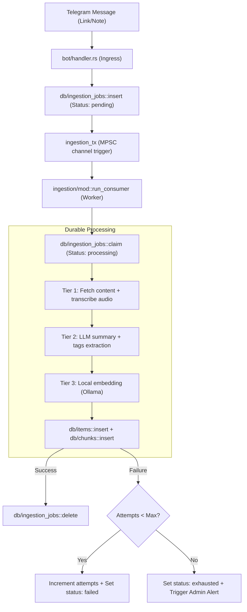
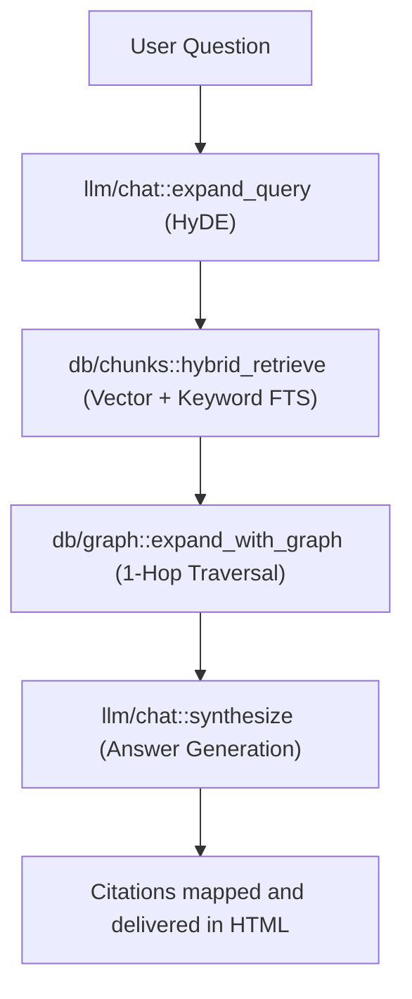
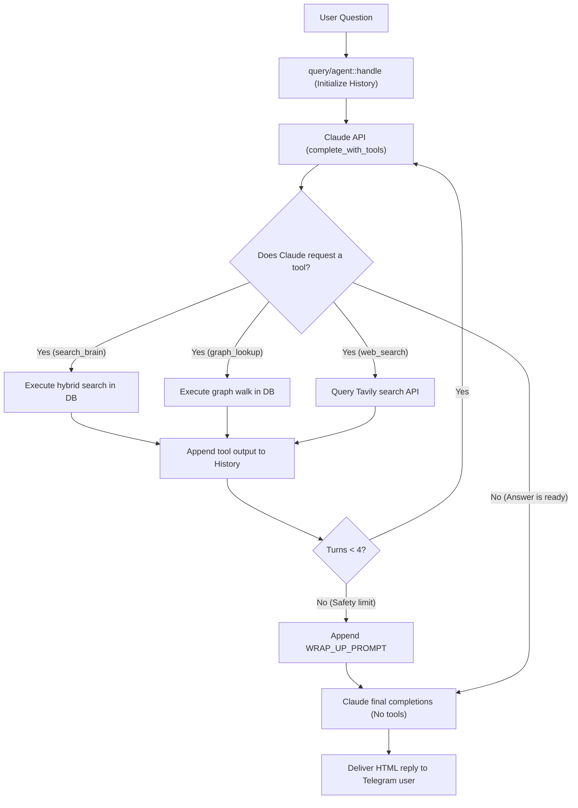

# System Architecture - Nexus on CockroachDB

Nexus is an always-on, globally distributed agentic memory layer that ingests multi-channel captures (links, text notes, voice recordings, and photos) and processes them into a searchable private knowledge brain. This document details the system design, database architecture, and RAG pipelines.

---

## 1. Core Database Schema (CockroachDB Serverless on AWS)

To support resilient, low-latency, and scalable vector operations, Nexus utilizes native CockroachDB capabilities. The relational schema is structured as follows:

| Table Name | Primary Key | Key Columns | Purpose |
| :--- | :--- | :--- | :--- |
| **`groups`** | `id` (BIGINT) | `name` (TEXT) | Represents Telegram group chats. |
| **`users`** | `id` (BIGINT) | `username` (TEXT), `first_name` (TEXT) | Stores user profiles. |
| **`items`** | `id` (UUID) | `url` (TEXT), `title` (TEXT), `summary` (TEXT), `embedding` (VECTOR), `context_window` (JSONB) | Permanent repository of captured documents, links, and notes. |
| **`chunks`** | `id` (UUID) | `item_id` (UUID), `content` (TEXT), `embedding` (VECTOR) | Split text passages of items, used for semantic search. |
| **`entities`** | `id` (UUID) | `group_id` (BIGINT), `name` (TEXT), `type` (TEXT) | Knowledge graph nodes (people, companies, topics). |
| **`edges`** | `group_id` (BIGINT) | `source_id` (UUID), `target_id` (UUID), `relationship` (TEXT) | Knowledge graph directed connections (e.g. `is_a`, `related_to`). |
| **`messages_buffer`**| `group_id` + `message_id`| `text` (TEXT), `user_id` (BIGINT) | Rolling 48-hour cache of chat history to build context. |
| **`ingestion_jobs`** | `id` (UUID) | `payload` (JSONB), `status` (TEXT), `attempts` (INT) | Persistent queue storage for durable ingestion. |

> [!NOTE]
> Vector indexes are built natively on CockroachDB using C-SPANN (`CREATE VECTOR INDEX`). All vector inserts (`VECTOR(1024)`) cross the wire as bracketed text lists (`[0.1, -0.4, ...]`) to circumvent client-side binary serialization quirks.

---

## 2. Ingestion Pipeline & Durable Queue

Nexus implements a persistent ingestion queue in CockroachDB to guarantee zero data loss. If the host machine restarts, ingestion resumes automatically.

---

## 3. Dual-Path Q&A Retrieval Engine (`/ask`)

Nexus offers two distinct modes for answering questions. You can toggle between them using the `RAG_MODE` environment variable.

### Comparison Table

| Metric / Aspect | Path A: Deterministic Pipeline | Path B: Agentic Loop |
| :--- | :--- | :--- |
| **Configuration** | `RAG_MODE=pipeline` (Default) | `RAG_MODE=agentic` |
| **Execution Cost** | Low (Single LLM synthesis call) | High (Multiple sequential LLM calls) |
| **Provider Support** | OpenAI-compatible (Ollama/DeepSeek) | Anthropic (Claude tool-use) |
| **Flexibility** | Fixed execution recipe | Dynamic tool-calling path decision |
| **Web Integration** | Appended at startup if `--web` | Invoked mid-reasoning via `web_search` |

---

### Path A: Deterministic Pipeline Flow
This is the default configuration. It executes a static sequence of database lookups and feeds the combined results to the LLM.

---

### Path B: Agentic Loop Flow
This is the advanced, cognitive configuration. It turns the LLM into a decision-making agent that operates tools dynamically.

---

## 4. Operational Systems

### A. Real-Time Prometheus Metrics (`src/metrics.rs`)
The Axum HTTP webhook server hosts a `/metrics` endpoint. This tracks:
* Ingestion success rates and latency timings.
* Inmemory ingestion queue depths (`messages_buffer` backlog).
* Query synthesis token counts and response speeds.

### B. Admin Alerts (`src/bot/alerts.rs`)
If a persistent ingestion job repeatedly fails and exhausts its attempts, the background worker routes an alert direct message to the user ID defined in `ADMIN_CHAT_ID`. This signals configuration, network, or scraper issues immediately.

### C. Cluster Management (`src/bot/commands.rs`)
By executing `/cluster`, the Telegram backend invokes the `ccloud` CLI, capturing cluster parameters, region coordinates, backup logs, and database metrics as JSON and formatting it for the chat room.
